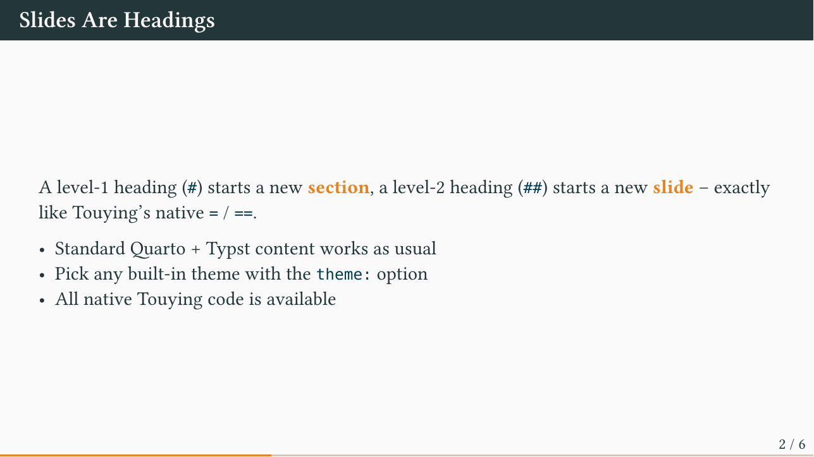

# quarto-touying-typst

[](https://github.com/kazuyanagimoto/quarto-touying-typst/actions/workflows/render.yml)
[](LICENSE)

A drop-in Quarto extension for building slides with
[Touying](https://touying-typ.github.io), the Beamer-like presentation
framework for Typst. This is the *base* extension: it wires Quarto's slide
syntax onto Touying and lets you pick any of Touying's built-in themes.
Theme-specific decks (e.g. the Clean theme) live in their own repositories and
build on top of this one.

> Status: **prototype** (v0.0.1). The bridge and theme selection work; the
> surface area is intentionally small.



## Install

```bash
quarto add kazuyanagimoto/quarto-touying-typst
```

Or start from the template:

```bash
quarto use template kazuyanagimoto/quarto-touying-typst
```

## Usage

```yaml
---
title: My Talk
subtitle: A subtitle
format: touying-typst
theme: metropolis      # metropolis | university | dewdrop | aqua | stargazer
aspect-ratio: "16-9"
author:
  - name: Your Name
    affiliations: Your Institution
institute: Your Institution
date: today
---

# A Section

## A Slide

Content goes here.
```

- `#` (level-1 heading) starts a new **section**
- `##` (level-2 heading) starts a new **slide**

This mirrors Touying's native `=` / `==`, so Quarto's structure maps onto
Touying with no extra markup. Use a `#` section before your `##` slides
(otherwise the shallowest heading is promoted to a section divider).

## Options

| Option         | Default      | Description                                            |
| -------------- | ------------ | ----------------------------------------------------- |
| `theme`        | `metropolis` | Built-in Touying theme to use                         |
| `aspect-ratio` | `16-9`       | Slide aspect ratio (`16-9`, `4-3`)                    |
| `handout`      | `false`      | Collapse all incremental reveals into a handout       |

Available themes: `metropolis`, `university`, `dewdrop`, `aqua`, `stargazer`,
`simple`, `default`.

## Reveal.js-style syntax

The goal is for Quarto's presentation syntax to work as-is. Currently bridged:

| Quarto                              | Behaviour                              |
| ----------------------------------- | -------------------------------------- |
| `. . .`                             | Pause (`#pause`)                       |
| `::: {.incremental}`                | Reveal list items one `#pause` at a time |
| `::: {.columns}` / `.column`        | Side-by-side columns (Typst grid)      |
| `::: {.notes}`                      | Speaker notes (hidden on the slide)    |
| `[text]{.button}`                   | Beamer-style button (clickable in a link) |
| `` / `` | `#pause` / `#meanwhile`              |

Columns honour the `width` attribute:

```markdown
:::: {.columns}
::: {.column width="40%"}
Left
:::
::: {.column width="60%"}
Right
:::
::::
```

## Native Touying

Touying code works anywhere, e.g. inline `#pause`. For multi-step reveals with
`uncover` / `only` / `alternatives`:

```markdown
::: {.complex-anim repeat="4"}
At subslide #only("2-")[two and later] and #uncover("3-")[three and later].
:::
```

## Adding a theme

Touying ships more theme functions than are wired up here. To expose one, add
it to the two maps in
[`_extensions/touying/typst-template.typ`](_extensions/touying/typst-template.typ)
(its `*-theme` show function and its `title-slide`).

## Relationship to other extensions

- This extension is the Touying counterpart to
  [`projector`](https://github.com/christopherkenny/projector) (which targets
  Polylux).
- [`quarto-clean-typst`](https://github.com/kazuyanagimoto/quarto-clean-typst)
  is a styled theme deck; the long-term plan is for theme repos like it to
  build on this base.

## License

MIT
