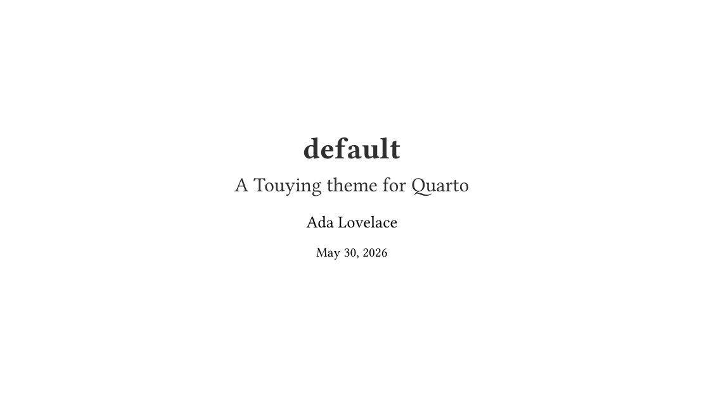
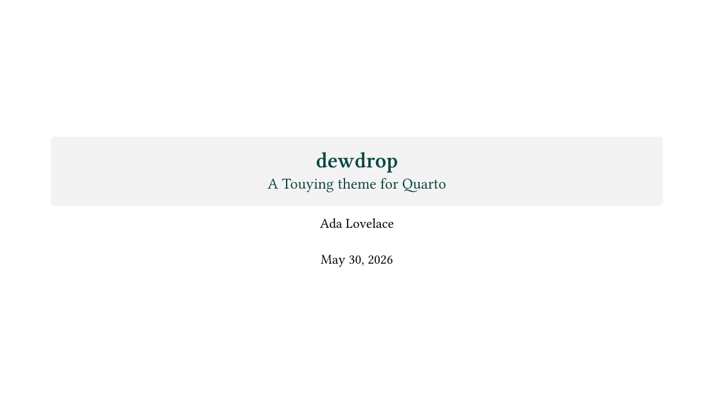
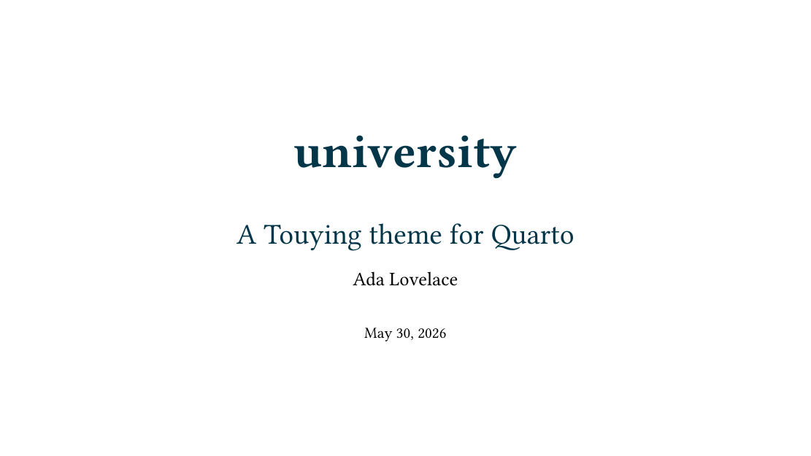
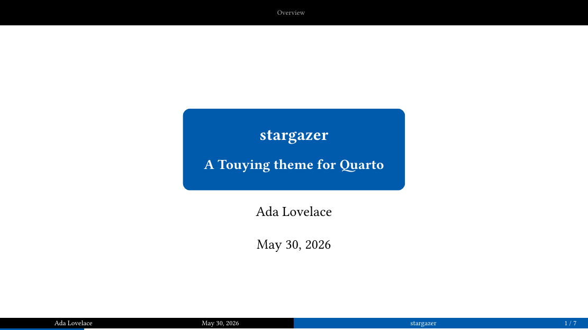
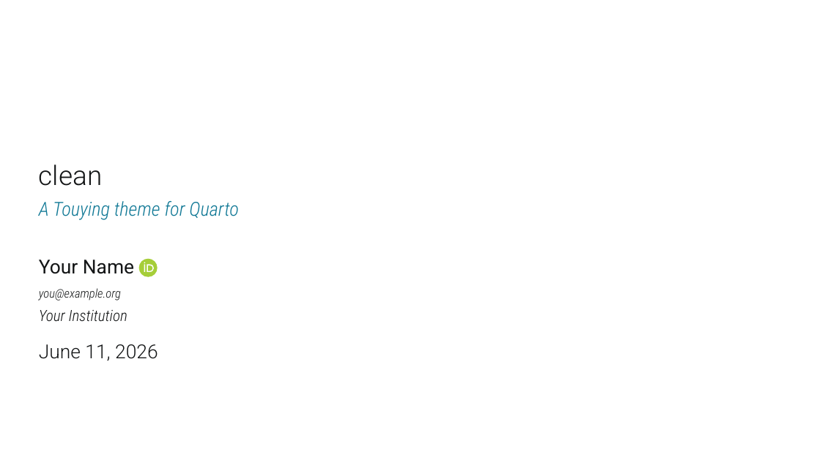
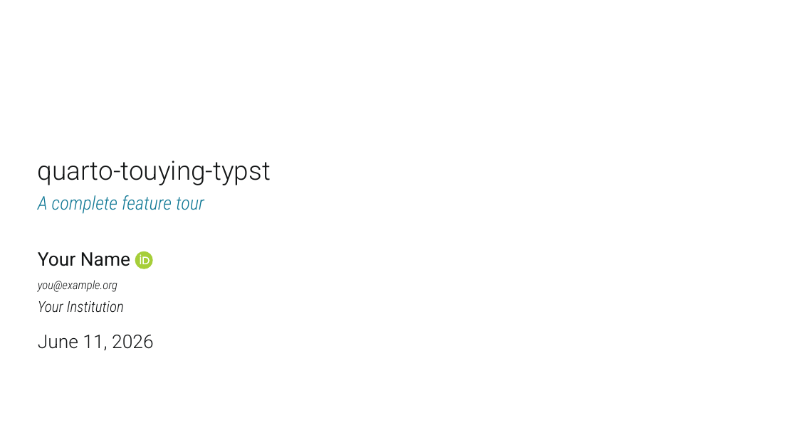
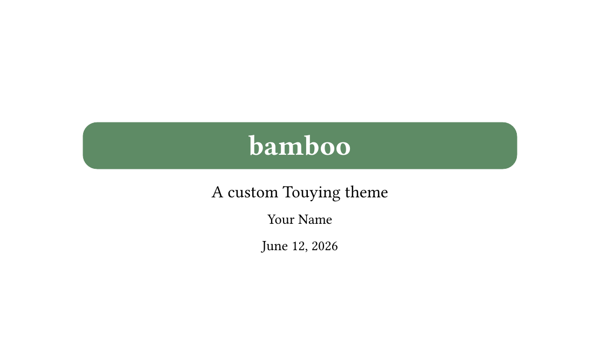
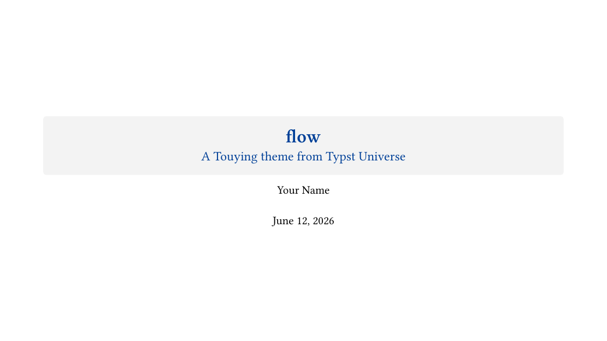

Every theme deck below is rendered from the [same source](https://github.com/kazuyanagimoto/quarto-touying-typst/blob/main/docs/gallery/_slides.qmd)
with a different `theme:` (seven built-in Touying themes plus the in-repo
`clean` theme). Click a card to **flip through the slides in your browser**
(navigable HTML exported with
[touying-exporter](https://github.com/touying-typ/touying-exporter)); use the
arrow keys, or grab the `PDF`.

::: {.gallery}
<div class="card"><a class="deck" href="slides/default.html"></a><div class="label"><a href="slides/default.html">default</a><a class="pdf" href="gallery/default.pdf">PDF</a></div></div>
<div class="card"><a class="deck" href="slides/simple.html"></a><div class="label"><a href="slides/simple.html">simple</a><a class="pdf" href="gallery/simple.pdf">PDF</a></div></div>
<div class="card"><a class="deck" href="slides/metropolis.html"></a><div class="label"><a href="slides/metropolis.html">metropolis</a><a class="pdf" href="gallery/metropolis.pdf">PDF</a></div></div>
<div class="card"><a class="deck" href="slides/dewdrop.html"></a><div class="label"><a href="slides/dewdrop.html">dewdrop</a><a class="pdf" href="gallery/dewdrop.pdf">PDF</a></div></div>
<div class="card"><a class="deck" href="slides/university.html"></a><div class="label"><a href="slides/university.html">university</a><a class="pdf" href="gallery/university.pdf">PDF</a></div></div>
<div class="card"><a class="deck" href="slides/aqua.html"></a><div class="label"><a href="slides/aqua.html">aqua</a><a class="pdf" href="gallery/aqua.pdf">PDF</a></div></div>
<div class="card"><a class="deck" href="slides/stargazer.html"></a><div class="label"><a href="slides/stargazer.html">stargazer</a><a class="pdf" href="gallery/stargazer.pdf">PDF</a></div></div>
<div class="card"><a class="deck" href="slides/clean.html"></a><div class="label"><a href="slides/clean.html">clean</a><a class="pdf" href="gallery/clean.pdf">PDF</a></div></div>
:::

<br>

## Full feature tour

A single deck (on the `clean` theme) that exercises the whole feature set --
emphasis classes, columns, citations, callouts, Typst CSS, animations, R
figures and tables, and an appendix. Flip through it in the browser, grab the
`PDF`, or read the `Code` to see exactly how each slide is written.

::: {.gallery}
<div class="card"><a class="deck" href="slides/full.html"></a><div class="label"><a href="slides/full.html">full</a><span class="links"><a class="pdf" href="https://github.com/kazuyanagimoto/quarto-touying-typst/blob/main/docs/gallery/full.qmd">Code</a><a class="pdf" href="gallery/full.pdf">PDF</a></span></div></div>
:::

<br>

## External themes

Any Touying theme works, not just the built-ins. Bring the theme function into
scope with `include-in-header` and name it with `theme-typst`:

- **`bamboo`** is a custom theme written from scratch -- the worked example from
  Touying's [Build Your Own Theme](https://touying-typ.github.io/docs/tutorials/build-your-own-theme)
  guide, shipped as a local `.typ` file.
- **`flow`** is [`touying-flow`](https://typst.app/universe/package/touying-flow),
  a theme published on [Typst Universe](https://typst.app/universe), pulled in
  with a one-line `#import`.

::: {.gallery}
<div class="card"><a class="deck" href="slides/bamboo.html"></a><div class="label"><a href="slides/bamboo.html">bamboo</a><span class="links"><a class="pdf" href="https://github.com/kazuyanagimoto/quarto-touying-typst/blob/main/docs/gallery/bamboo.qmd">Code</a><a class="pdf" href="gallery/bamboo.pdf">PDF</a></span></div></div>
<div class="card"><a class="deck" href="slides/flow.html"></a><div class="label"><a href="slides/flow.html">flow</a><span class="links"><a class="pdf" href="https://github.com/kazuyanagimoto/quarto-touying-typst/blob/main/docs/gallery/flow.qmd">Code</a><a class="pdf" href="gallery/flow.pdf">PDF</a></span></div></div>
:::

```{=html}
<div class="deck-modal" id="deck-lightbox" aria-hidden="true">
  <div class="frame">
    <button class="close" id="deck-close" aria-label="Close">&times;</button>
    <iframe id="deck-iframe" title="Slide deck" allowfullscreen></iframe>
  </div>
</div>
<script>
(function () {
  const box = document.getElementById('deck-lightbox');
  const frame = document.getElementById('deck-iframe');
  const close = document.getElementById('deck-close');

  function open(url) {
    frame.src = url;
    box.classList.add('open');
    box.setAttribute('aria-hidden', 'false');
    // focus the iframe so arrow keys drive the deck
    frame.addEventListener('load', () => {
      try { frame.contentWindow.focus(); } catch (e) {}
    }, { once: true });
  }
  function shut() {
    box.classList.remove('open');
    box.setAttribute('aria-hidden', 'true');
    frame.src = 'about:blank';
  }

  document.querySelectorAll('.gallery a[href$=".html"]').forEach((a) => {
    a.addEventListener('click', (e) => {
      e.preventDefault();
      open(a.getAttribute('href'));
    });
  });
  close.addEventListener('click', shut);
  box.addEventListener('click', (e) => { if (e.target === box) shut(); });
  document.addEventListener('keydown', (e) => {
    if (e.key === 'Escape' && box.classList.contains('open')) shut();
  });
})();
</script>
```
