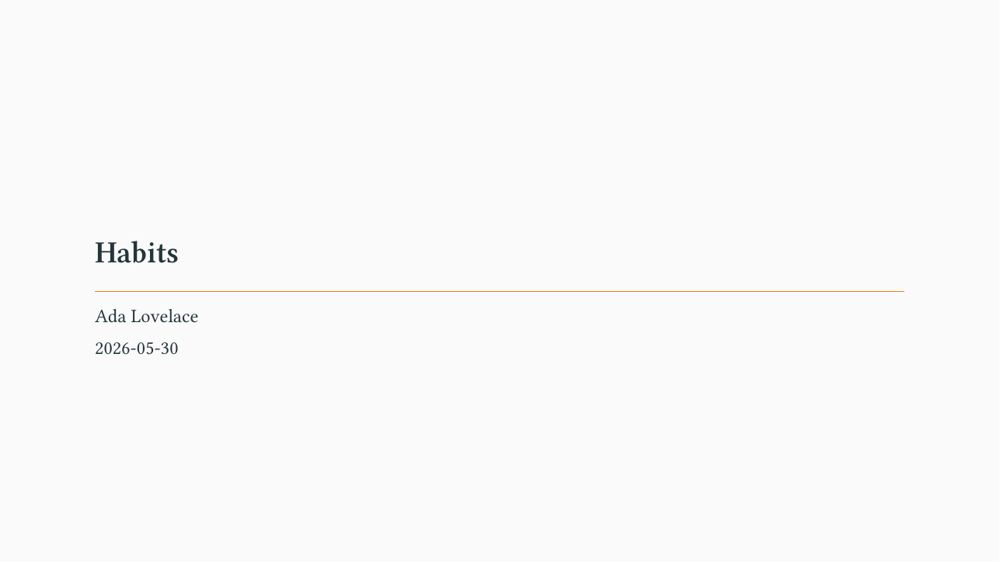
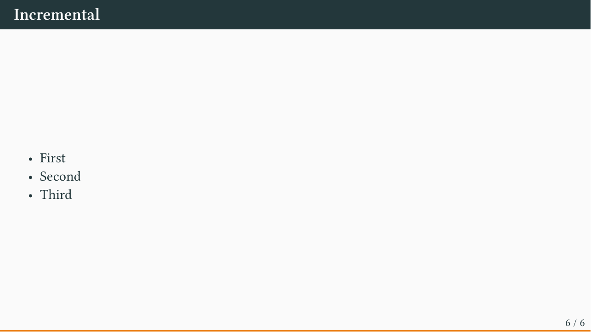
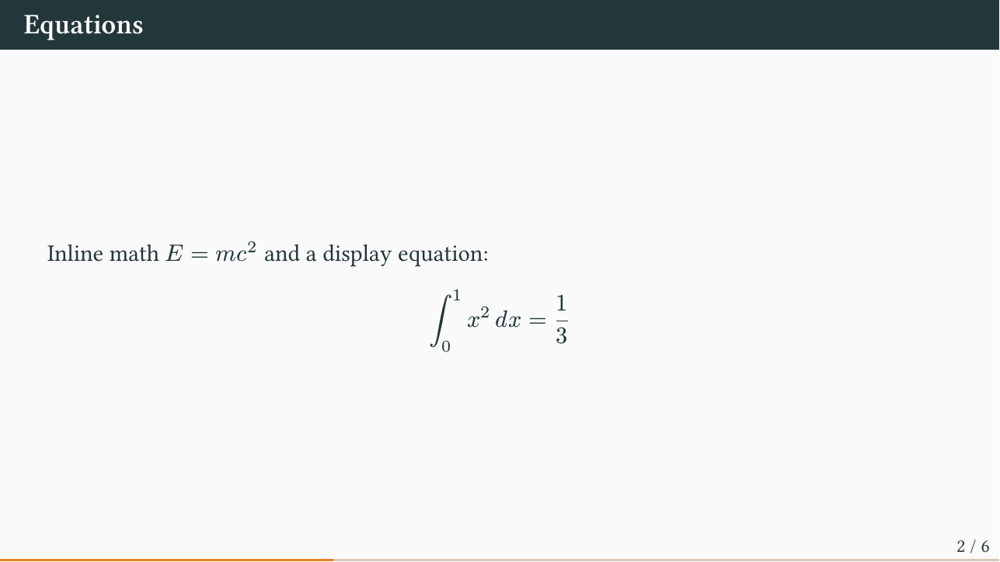
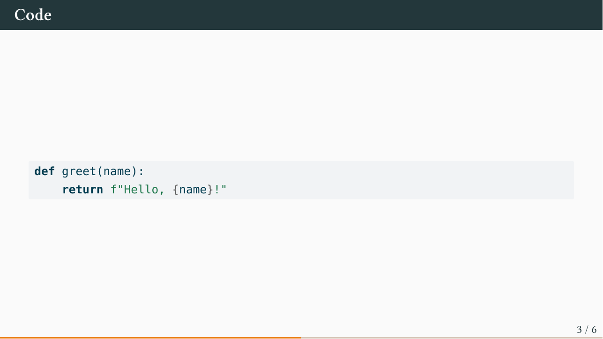

This walkthrough mirrors Quarto's
[Reveal.js tutorial](https://quarto.org/docs/presentations/revealjs/), but
targets [Touying](https://touying-typ.github.io) — the Beamer-style
presentation framework for Typst. If you have written Reveal.js slides in
Quarto, almost everything here will feel familiar.

## Overview

`quarto-touying-typst` is a drop-in Quarto extension. You write ordinary Quarto
Markdown and get a Typst-rendered PDF deck, with a built-in theme chosen by a
single `theme:` option. Install it into a project with:

```bash
quarto add kazuyanagimoto/quarto-touying-typst
```

A minimal presentation is just a `.qmd` file with `format: touying-typst`:

```yaml
---
title: "Habits"
author: "Ada Lovelace"
date: today
format: touying-typst
theme: metropolis
---
```

Render it the usual way:

```bash
quarto render habits.qmd
```

::: {.callout-tip}
Don't have a project yet? Start from the template:

```bash
quarto use template kazuyanagimoto/quarto-touying-typst
```
:::

## Creating slides

Slides are delineated by Markdown headings, exactly like Touying's native
`=` / `==` and like Reveal.js:

- A level-1 heading (`#`) starts a **section** (a divider slide).
- A level-2 heading (`##`) starts a **content slide**.

```markdown
# In the morning

## Getting up

- Turn off alarm
- Get out of bed

## Breakfast

- Eat eggs
- Drink coffee
```

The `#` heading produces a section divider, and each `##` becomes a slide:

::: {layout-ncol=2}


:::

### Title slide

A title slide is generated automatically from the `title`, `subtitle`,
`author`, and `date` fields in your YAML front matter.

{width=70%}

The `clean` theme also renders structured authors with affiliation, email, and
ORCID — see the [gallery](index.qmd).

### Heading levels

By default Quarto promotes the shallowest heading, so a deck that uses **only**
`##` turns those into section dividers. Either put a `#` section before your
`##` slides, or disable the promotion so `##` always stays a slide:

```yaml
format: touying-typst
shift-heading-level-by: 0   # `##` stays a slide even without a leading `#`
```

This is handy when porting a Reveal.js deck that only uses `##`.

## Incremental content

To reveal content step by step, wrap it in a `.incremental` div:

```markdown
::: {.incremental}
- First
- Then second
- Then third
:::
```



You can also break *anywhere* with a pause marker — three dots on their own
line:

```markdown
First this shows.

. . .

Then this appears.
```

`.only` / `.uncover` reveal a span or a whole block from a given sub-slide on
(the `options` are passed straight to the Touying function):

```markdown
[shown from sub-slide 2]{.only options='"2-"'}

::: {.uncover options='"3-"'}
This block is uncovered on sub-slide 3.
:::
```

For fine-grained control (revealing across multiple sub-slides, hiding rather
than appending), use Touying's `uncover` / `only` / `alternatives` inside a
`.complex-anim` block:

```markdown
::: {.complex-anim repeat="4"}
At subslide #only("2-")[two and later] and #uncover("3-")[three and later].
:::
```

## Multiple columns

Place content side by side with `.columns` / `.column` and a `width`:

```markdown
:::: {.columns}
::: {.column width="40%"}
Left column.
:::
::: {.column width="60%"}
Right column, a little wider.
:::
::::
```


## Speaker notes

Notes are written in a `.notes` div. They are kept out of the slide (matching
Reveal.js behaviour):

```markdown
## A slide

Visible content.

::: {.notes}
Only you see these notes.
:::
```

## Content

All of the standard Quarto + Typst content works without any extra setup.

### Equations

Inline `$E = mc^2$` and display math render with Typst's typesetting:

```markdown
$$\int_0^1 x^2 \, dx = \frac{1}{3}$$
```



### Code blocks

Fenced code blocks are syntax-highlighted:

````markdown
```python
def greet(name):
    return f"Hello, {name}!"
```
````



Executable code works too — add an R or Python chunk and Quarto runs it,
embedding the output (figures, tables) into the slide. Source is hidden by
default in presentations; show it with `echo: true`.

### Tables and images

Markdown tables and `` images render as expected. For richer
tables, use [`tinytable`](https://vincentarelbundock.github.io/tinytable/) from
an executable chunk.

## Themes

Switch the whole look with one option:

```yaml
format: touying-typst
theme: dewdrop   # default | simple | metropolis | dewdrop
                 # university | aqua | stargazer | clean
```

Eight themes ship with the extension. Browse them — and flip through a full deck
in each — on the [Gallery](index.qmd) page.

You can nudge colours and fonts from the front matter:

```yaml
accent: "1f6feb"       # primary colour (hex, no #)
accent2: "9a2515"      # secondary colour
jet: "1b1f24"          # body text colour
sansfont: "Fira Sans"  # heading font
mainfont: "Source Serif"
fontsize: 22pt
```

### Brand

A [Quarto brand](https://quarto.org/docs/authoring/brand.html) (`_brand.yml`
or a `brand:` key) is picked up automatically as a fallback for the options
above. `brand.color.primary` / `secondary` / `foreground` set the palette (for
every theme), and `brand.typography` sets the fonts (for the `clean` theme):

```yaml
brand:
  color:
    primary: "#1f6feb"
    secondary: "#cf222e"
    foreground: "#1b1f24"
  typography:
    headings: { family: "Fira Sans", weight: 600 }
    base: { family: "Source Serif 4" }
```

Explicit `accent` / `sansfont` / … always take precedence over `brand`.

## Emphasis and buttons

The extension adds a few inline helpers:

| Markup                                          | Renders                    |
| ----------------------------------------------- | -------------------------- |
| `[text]{.alert}`                                | Accent-coloured emphasis   |
| `[text]{.fg options='fill: rgb("#5D639E")'}`    | Custom-coloured text       |
| `[text]{.bg}`                                   | Highlighted background     |
| `[[label]{.button}](#target)`                   | Beamer-style goto button   |

`.alert` works in every theme; `.fg` / `.bg` / `.button` are theme-independent
and pick up the active theme's colours.

These are *commands* (inline) and *environments* (block) — `[x]{.cmd}` becomes
`#cmd()[x]` and `::: {.env}` becomes `#env()[…]`, with any `options` passed
through. Map your own to any Typst function from the front matter:

```yaml
commands:                 # inline spans  ->  #note()[…]
  - note
environments:             # block divs    ->  #boxed()[…]
  boxed: rect             # class `.boxed` calls Typst's `rect`
```

## Native Touying

Anything Touying can do is available as raw Typst. Inline `#pause`,
`#meanwhile`, and any Touying function can be dropped straight into your
Markdown. A few extras:

```yaml
aspect-ratio: "16-9"   # or "4-3"
handout: true          # collapse every incremental reveal into one slide
```

Mark the start of back-matter with the `appendix` shortcode — it freezes the
slide counter so appendix slides don't inflate the total in the footer:

```markdown


## Extra slide
```

## Learning more

- [Gallery](index.qmd) — every theme, side by side
- [Touying documentation](https://touying-typ.github.io) — the underlying framework
- [Quarto + Typst](https://quarto.org/docs/output-formats/typst.html) — the Typst output format
- [README](https://github.com/kazuyanagimoto/quarto-touying-typst) — install and reference
