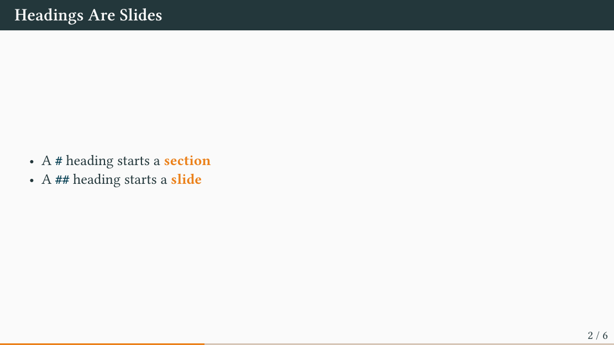
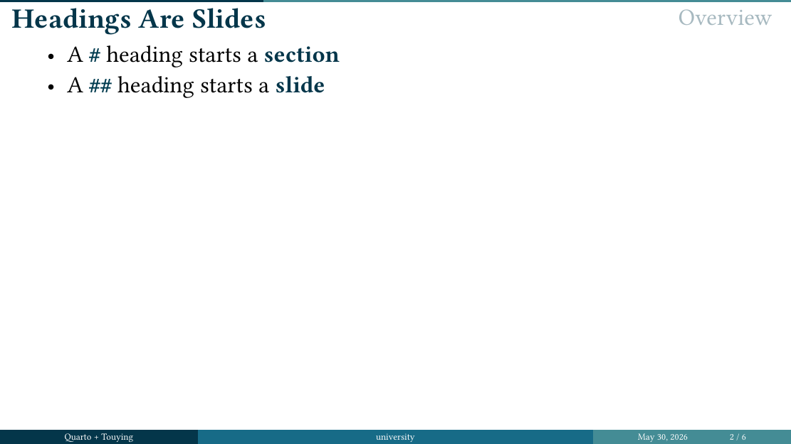
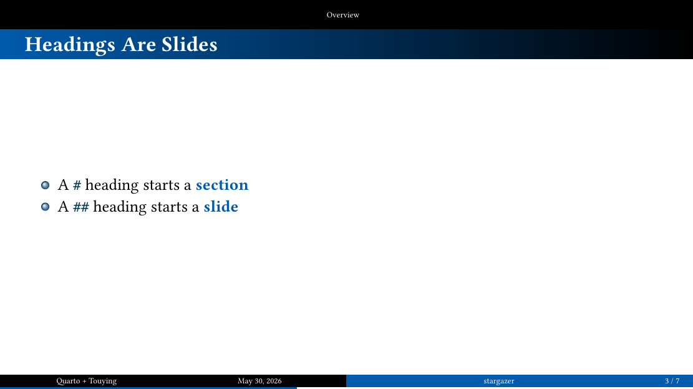
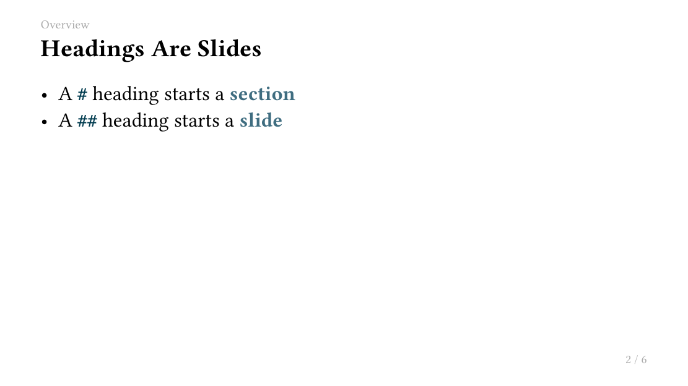
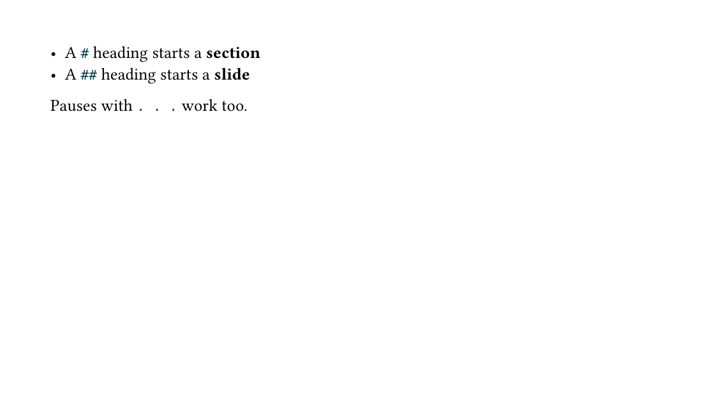

A drop-in Quarto extension that bridges Quarto's slide syntax onto
[Touying](https://touying-typ.github.io). Pick any built-in theme with a single
`theme:` option. See the [README](https://github.com/kazuyanagimoto/quarto-touying-typst)
for installation and usage.

```bash
quarto add kazuyanagimoto/quarto-touying-typst
```

## Theme gallery

Each card links to a PDF rendered from the [same source](https://github.com/kazuyanagimoto/quarto-touying-typst/blob/main/examples/_slides.qmd)
with a different `theme:`.

::: {.gallery}
<a class="card" href="examples/metropolis.pdf"><div class="label">metropolis</div></a>
<a class="card" href="examples/university.pdf"><div class="label">university</div></a>
<a class="card" href="examples/dewdrop.pdf"><div class="label">dewdrop</div></a>
<a class="card" href="examples/aqua.pdf"><div class="label">aqua</div></a>
<a class="card" href="examples/stargazer.pdf"><div class="label">stargazer</div></a>
<a class="card" href="examples/simple.pdf"><div class="label">simple</div></a>
<a class="card" href="examples/default.pdf"><div class="label">default</div></a>
:::
